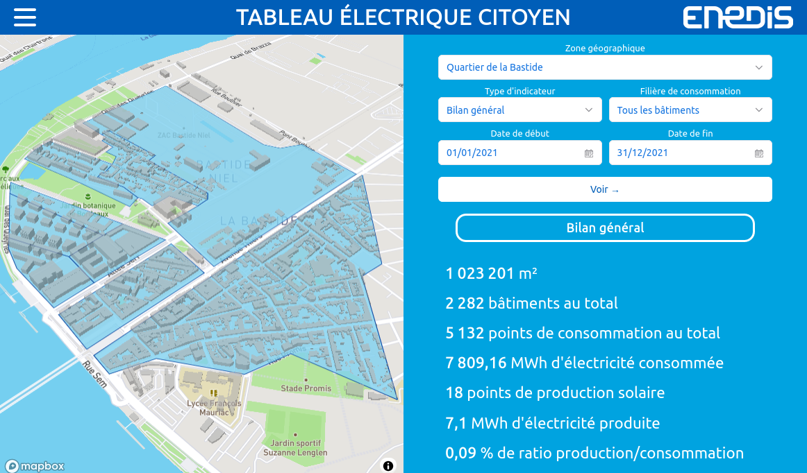

# Introduction

Le Tableau Électrique Citoyen (TEC) est une preuve de concept sous forme de site web, permettant de suivre la consommation et la production électrique d'un quartier, ainsi que de prévoir, grâce au machine learning, les futures consommations et productions.

Cette preuve de concept se focalise uniquement sur le quartier de la Bastide, à Bordeaux, et présente des données factices.

## Context

Le TEC est un Projet au Fil de l'Année (PFA) développé par des élèves de l'école [ENSEIRB-MATMECA](https://enseirb-matmeca.bordeaux-inp.fr/fr) sur l'année scolaire 2021/2022.

Les PFA sont des projets réalisés en équipe, lors de la deuxième année de la formation, avec la participation de clients (ici [Enedis](https://www.enedis.fr/), l'[ENSEIRB-MATMECA](https://enseirb-matmeca.bordeaux-inp.fr/fr) et l'[URISA/IESF Nouvelle-Aquitaine](https://www.iesf-na.fr/)).
Ils permettent d'avoir un premier aperçu de la gestion d'un projet dans un environnement un peu moins académique et plus professionnel.

## But de ce document

L'objectif de cette documentation technique est double.
Le premier objectif est de permettre, à une future équipe de développement, de pouvoir reprendre le projet.
Le second objectif est d'expliquer comment déployer le TEC vers un environnement de production.

## Structure générale

Le projet se divise en trois blocs majeurs:

- un client ([React](https://reactjs.org/));
- un serveur web ([Node.js](https://nodejs.org/en/));
- et des scripts de machine learning ([Prophet](https://facebook.github.io/prophet/)).

Chacun de ces blocs sera détaillé dans les parties à vernir de la documentation.
Une dernière partie sera consacrée à l'infrastructure et au déploiement.

## Cadre légal

### Propriété intellectuelle

Selon l'accord oral des clients, les sources du logiciel sont disponibles sous une licence open source au choix de l'équipe de développement.
[L'ensemble des sources](https://gitlab.com/PROFeNoM/dashboard) du logiciel est donc licencié sous la [GNU General Public License 3](https://www.gnu.org/licenses/gpl-3.0.en.html).

### Partie prenantes

Encadrant :

- Herbreteau Frédéric (enseignant chercheur — ENSEIRB-MATMECA)

Clients :

- Demay Henry-Pierre (relation collectivités — Enedis)
- Marty Olivier (responsable pôle PMIS — URISA/IESF Nouvelle-Aquitaine)
- Mollard Yoan (ingénieur de recherche en robotique — ENSEIRB-MATMECA)

Équipe de développement :

- Agtaib Badre Iddine (élève — ENSEIRB-MATMECA)
- Boitel Faustin (élève — ENSEIRB-MATMECA)
- Choura Alexandre  (élève — ENSEIRB-MATMECA)
- Gomichon Théo (élève — ENSEIRB-MATMECA)
- Mansouri Othmane (élève — ENSEIRB-MATMECA)
- Saccoccio Clément (élève — ENSEIRB-MATMECA)
- Tilfani Aymen (élève — ENSEIRB-MATMECA)