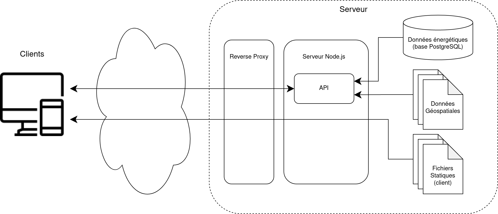

# Infrastructure

Une fois déployée, l'application prend la forme suivante :



Un serveur [Node.js](https://nodejs.org/en/) s'occupe de faire fonctionner l'API ainsi que de servir les fichiers statiques, qu'il s'agisse des GeoJSON ou des fichier du client web.

Une base de données [PostgreSQL](https://www.postgresql.org/) est également nécessaire pour le stockage des données énergétiques.

Enfin, la présence d'un reverse proxy est recommandé pour ajouter divers fonctionnalité optionnelles telles que :

- le chiffrement du trafic (HTTPS);
- une protection au DDoS;
- divers règles de routage du trafic;
- une restriction d'accès au site via mot de passe.

## Intégration Continue

Un pipeline d'intégration continue a été mis en place sur le [dépôt GitLab](https://gitlab.com/PROFeNoM/dashboard) afin de générer une image [Docker](https://www.docker.com/).
Il suffit d'ajouter un tag git portant le numéro de version, sans oublier de mettre à jour le numéro de version dans les `package.json`, afin de lancer la partie du pipeline qui s'occupe de générer l'image [Docker](https://www.docker.com/).
Les images sont ensuite disponibles dans le [registre de conteneurs du dépôt GitLab](https://gitlab.com/PROFeNoM/dashboard/container_registry/2783613).
Chaque image est disponible pour les architectures `linux/arm64` et `linux/amd64`.

## Déploiement

Voici un `docker-compose.yml` minimal permettant de déployer l'application :

```yml
version: 3.5

services:

  tec-web:
    container_name: 'tec-web'
    image: 'registry.gitlab.com/profenom/dashboard:latest'
    restart: 'unless-stopped'
    depends_on:
    - 'tec-database'
    volumes:
    - './geodata/:/etc/tec/geodata/:ro'
    ports:
    - '80:80'
    networks:
    - 'tec-network'
    environment:
      DATABASE_HOST: 'tec-database'
      DATABASE_PASSWORD: PASSWORD_HERE

  tec-database:
    container_name: 'tec-database'
    image: 'postgres:14-alpine'
    restart: 'unless-stopped'
    volumes:
    - './tec-database/:/var/lib/postgresql/data/:rw'
    networks:
    - 'tec-network'
    environment:
      POSTGRES_PASSWORD: PASSWORD_HERE

networks:
  tec-network:
    name: tec-network
```

Avant de lancer ce `docker-compose.yml`, il est nécessaire de remplacer les `PASSWORD_HERE` par un mot de passe qui sera utilisé pour se connecter à la base.
Il est conseillé de choisir ce mot de passe aléatoirement :

```bash
openssl rand -base64 20
```

Aussi, il est nécessaire d'avoir un répertoire nommé `geodata` contenant les données géospatiales.
Un exemple peut être trouvé sur le [dépôt git](https://gitlab.com/PROFeNoM/dashboard/-/tree/master/server/geodata).

Enfin, en lançant le `docker-compose.yml` (`docker-compose up`) les images [Docker](https://www.docker.com/) de l'application ainsi que de [PostgreSQL](https://www.postgresql.org/) seront téléchargées et lancées.
Le répertoire `tec-database` sera également créé et contiendra la base de données.

Il ne reste plus qu'à remplir la base de données avec des données historiques et les scripts de prédiction.
