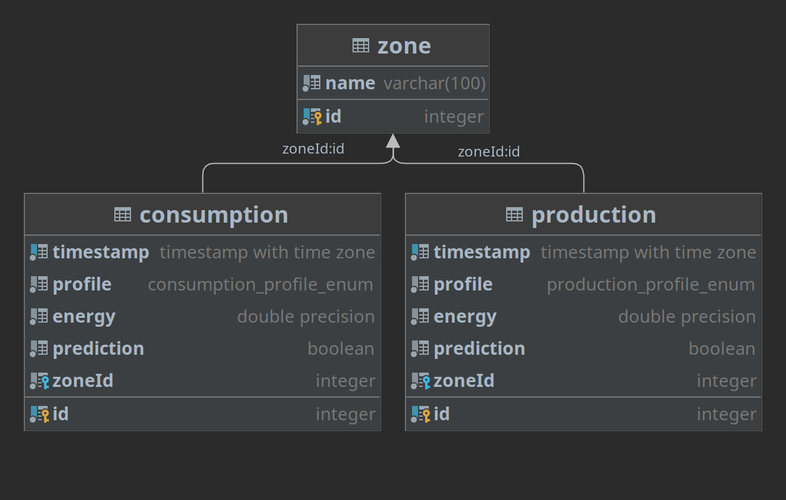

# Serveur

## Description générale

### Technologies utilisées

Le serveur web est développé en [TypeScript](https://www.typescriptlang.org/) et tourne dans l'interpréteur [Node.js](https://nodejs.org/en/).
Il gère les requêtes API et sert les fichiers statiques par l'intermédiaire de la bibliothèque [Express](https://expressjs.com/) et il communique avec une base de données [PostgreSQL](https://www.postgresql.org/) à l'aide de l'ORM [typeORM](https://typeorm.io/).

### Schéma de la base de données



Le schéma de la base est relativement simple.
Elle est plus utilisée pour sa capacité à stocker un grand nombre de données et à faire des opérations rapides sur celles-ci, plutôt que sont aspect relationnel (bien qu'util pour grouper les données par zone).

`Consumption` et `Production` sont des tables "miroir" car elle stockent des données ayant quasiment la même structure (à l'exception du champ `profile`).
Ces deux tables sont référencées indistinctement en tant qua `DataTable`.

Chaque ligne d'une `DataTable` stocke une donnée énergétique au pas de la demi-heure :

- `timestamp` : l'horodatage – un index a été rajouté sur cette colonne pour gagner en efficacité, car toutes les requêtes se font sur un interval de temps donné
- `profile` : une énumération PostgreSQL
	- dans le cas d'une consommation, une des valeurs suivantes :
		- `PUBLIC_LIGHTING`
		- `PROFESSIONAL`
		- `RESIDENTIAL `
		- `TERTIARY`
	- dans le cas d'une production, une des valeurs suivantes :
		- `BIOENERGY`
		- `EOLIAN`
		- `HYDRAULIC`
		- `NON_RENEWABLE_THERMAL`
		- `OTHER`
		- `SOLAR`
		- `TOTAL`
- `energy` : l'énergie en W/h
- `prediction` : booléen indiquant si il s'agit d'une véritable donnée historique (`false`) ou d'une prédiction (`true`)
- `zoneId` : ID de la zone que cette donnée énergétique concerne
- `id` : ID interne à la base pour identifier cette ligne

La table `Zone` est là pour identifier différentes zones géographiques.
Dans le cas de la Bastide, il s'agît de sous-quartiers (exemple : "quartier historique Nord Thiers").

Il est à noter que, bien que non mentionnée, la table `typeorm_metadata` sert au fonctionnement interne de [typeORM](https://typeorm.io/).

### Données géospatiales

En plus des larges quantités de données énergétiques stockées en base, le serveur manipule également des données géospatiales.
Un exemple de ces données est disponible dans le répertoire [server/geodata](https://gitlab.com/PROFeNoM/dashboard/-/tree/master/server/geodata).

En environnement de développement c'est le répertoire [server/geodata](https://gitlab.com/PROFeNoM/dashboard/-/tree/master/server/geodata) qui est utilisé, mais en environnement de production, ces données doivent être fournies et placées dans le répertoire `/etc/tec/geodata`.

Les données géospatiales sont réparties dans les fichiers suivants :

- `buildings.json` : la liste des bâtiments (leur catégorie, leur forme, leur position géographiques, etc...)
- `charging-stations.json` : la liste de stations de recharge des véhicules électriques (avec leur emplacement géographique)
- `public-lighting.json` : la liste de lampadaires (avec leur emplacement géographique)
- `zones.json` : la liste des zones (avec la démarcation géographique de leur périmètre) come par exemple, les sous-quartiers de la Bastide

## Mise en place de l’environnement de développement

Pré-requis :

- [Docker](https://www.docker.com/)
- [Docker Compose](https://docs.docker.com/compose/)
- [PNPM](https://pnpm.io/)

Le téléchargement des sources et l'installations des dépendances se fait comme suit :

```bash
git clone https://gitlab.com/PROFeNoM/dashboard.git
cd dashboard/server
pnpm install
```

Quant à la base de donnée, on peut la lancer et la remplir de données factices (mock), allant du 1^er^ juin au 31 décembre 2021, comme ceci :

```bash
pnpm build
pnpm generate-mock-data
pnpm load-data-to-db
```

Enfin, pour lancer le serveur en mode "watch" (redémarrage à chaque modification) :

```bash
pnpm watch
```

## URL exposées & Points d'accès API

### Existant

#### Données statiques

Le serveur expose les fichiers statiques.
En environnement de développement il s'agît des fichiers présents dans `client/build`.
Un build du client est donc nécessaire pour avoir ces fichiers, mais en environnement de développement, il est préférable d'accéder au client via le serveur de développement React.

Le serveur expose également les données géospatiale aux URL `/api/v1/geodata/{nom_du_fichier}`.

#### Données dynamiques agrégées

Il est possible d'interroger la base de données grace aux URL de la forme :

- `/api/v1/{data_table}/total` : obtenir la consommation ou production totale (en W/h)
- `/api/v1/{data_table}/hourly-mean` : obtenir la consommation ou production moyenne (en W/h) pour chaque heure de la journée

`data_table` peut valoir `consumption` ou `production` et différents paramètres peuvent être rajoutés (certains sont obligatoires) :

| nom        | nécessité   | type                                                                          | description                                                  |
|------------|-------------|-------------------------------------------------------------------------------|--------------------------------------------------------------|
| `minDate`  | obligatoire | Unix epoch millis                                                             | début de l'interval à prendre en compte                      |
| `maxDate`  | obligatoire | Unix epoch millis                                                             | fin de l'interval à prendre en compte                        |
| `profiles` | optionnel   | liste de profils (voir le [schéma de la base](#schema-de-la-base-de-donnees)) | profils à prendre en compte (si aucun, tout est sélectionné) |
| `zoneName` | optionnel   | string                                                                        | zone à prendre en compte (si absent, tout est sélectionné)   |

Exemple :

```url
/api/v1/production/total?minDate=1609520655276&maxDate=1627747455279&profiles[0]=SOLAR&zone=Bastide%20Niel
```

#### Autre données dynamiques

Le point d'accès `/api/v1/{data_table}/max-timestamp` permet de récupérer l'horodatage de la dernière donnée historique (qui n'est pas une prédiction).
`data_table` peut valoir `consumption` ou `production`.

Exemple :

```url
/api/v1/production/max-timestamp
```


### Ajout d'un point d'accès API

L'ajout d'un point d'accès API se fait dans le fichier [server/src/server.ts](https://gitlab.com/PROFeNoM/dashboard/-/blob/master/server/src/server.ts).

La [documentation d'Express](https://expressjs.com/en/4x/api.html) explique comment procéder.

Si le nouveau point d'accès fonctionne sur la même base que `total` et `hourly-mean` (si les paramètres sont les mêmes), le middleware `apiReqCheckerParser` doit être utilisé pour vérifier la requête et la "parser".
Dans ce cas, les options "parsées" ainsi que la `DataTable` seront rajoutés dans l'objet de la requête par effet de bord.

##  Ajouter des données de prédictions à la base

### Générer les prédictions par Python

Les prédictions peuvent être obtenues par l'intermédiaire du script Python `predictions/generate_csv.py`, en l'utilisant de la manière suivante:

```bash
python generate_csv.py -pm <pm> -pt <pt> -d <d> -e <e> -o <o> -t <t>
```
où:

- pm: Chemin du modèle des courbes moyennes du profil considéré
- pt: Chemin du modèle d'énergie totale du profil considéré
- d: Date de début des prédictions, au format `YYYY-MM-DD`
- e: Date de fin des prédictions, au format `YYYY-MM-DD`
- o: Chemin du fichier de sortie
- t: Profil des prédictions (`RES`, `PRO`, `ENT`, `SOLAR`, ou `LIGHTING`)

Tous les paramètres sont obligatoires pour un fonctionnement cohérent, à l'exception de la situation où le profil de prédictions est `LIGHTING`; dans ce cas, -pm et -pt sont inutiles.

_Exemple d'utilisation_:

```bash
python generate_csv.py -pm models/mean_curve_models/solar.pickle -pt models/total_models/solar.pickle -d 2022-01-01 -e 2022-03-31 -o test2.csv -t SOLAR
```

### Charger les prédictions dans la base

Le chargement des données en base s'appuie sur le script
`load-prediction-to-db.js`, issu de `server/src/scripts/load-predictions-to-db.js`.

**Générer les scripts**

Dans le dossier `server`, lancer la base de données:

```bash
docker-compose up
```

puis:

```bash
pnpm build
```

Un dossier `build` sera alors créé, composé de fichier `.js`.

**Générer les CSV chargeables**

La création des CSV loadable dans la base exploite le script `build/scripts/generate-mock-predictions.js`, issu de `server/src/scripts/generate-mock-predictions.js`, de la manière suivante:

```
node build/scripts/generate-mock-predictions.js <srcPath> <destPath>
```

où:

- srcPath: Chemin du CSV issues du script de prédiction Python
- destPath: Destination du mock csv

_Exemple d'utilisation_:

```bash
node build/scripts/generate-mock-predictions.js ../predictions/sampleForecasts/sampleResT12022.csv raw-data/mock/resR12022Consumption.csv
```

**Charger dans la base**

Il suffit ensuite de se servir du script `load-prediction-to-db.js` de la manière suivante:

```bash
node build/scripts/load-predictions-to-db.js <srcPath> <profileType>
```

où:

- srcPath: Chemin du CSV issu du script de génération de mock
- profileType: Type de profil des prédictions (`consumption`, ou `production`)

_Exemple d'utilisation_:
```bash
node build/scripts/load-prediction-to-db.js raw-data/mock/resT12022Consumption.csv consumption
```
